# Arquitetura Atual — DevOps Playground

## 1. Objetivo

Este documento representa a arquitetura atualmente declarada no repositório do projeto.

A antiga VPS não está mais acessível. Portanto, os diagramas abaixo representam o **estado desejado versionado**, e não uma confirmação do estado real que estava executando no servidor.

---

## 2. Visão geral

A plataforma utiliza uma aplicação Spring Boot executada em container Docker.

Em produção, o tráfego seria recebido pelo Nginx, encaminhado para o backend e processado com apoio de PostgreSQL, Redis e RabbitMQ.

Prometheus coleta métricas do backend, enquanto Grafana é utilizado para visualização.

O deploy é automatizado pelo GitHub Actions, que:

1. constrói a imagem;
2. publica a imagem no GHCR;
3. copia as configurações de produção;
4. acessa a VPS por SSH;
5. executa Docker Compose.

---

## 3. Diagrama da arquitetura de produção

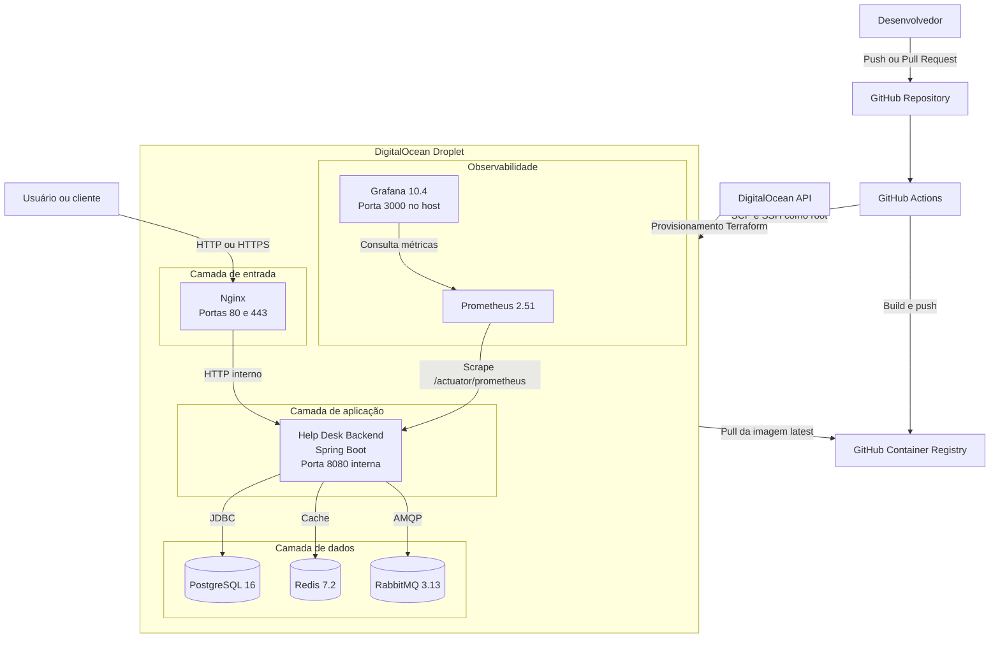

---

## 4. Fluxo atual de CI

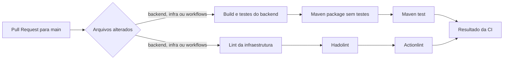

### Limitações do fluxo

* executa apenas em Pull Requests direcionados à `main`;
* não cobre Pull Requests direcionados à `dev`;
* não valida Terraform;
* não valida Docker Compose;
* não executa análise de cobertura;
* não executa scan de secrets;
* não executa scan de vulnerabilidades;
* não produz SBOM.

---

## 5. Fluxo atual de CD

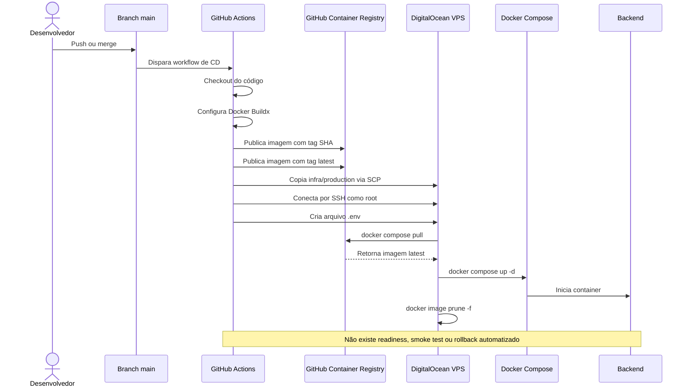

---

## 6. Fluxo de requisição

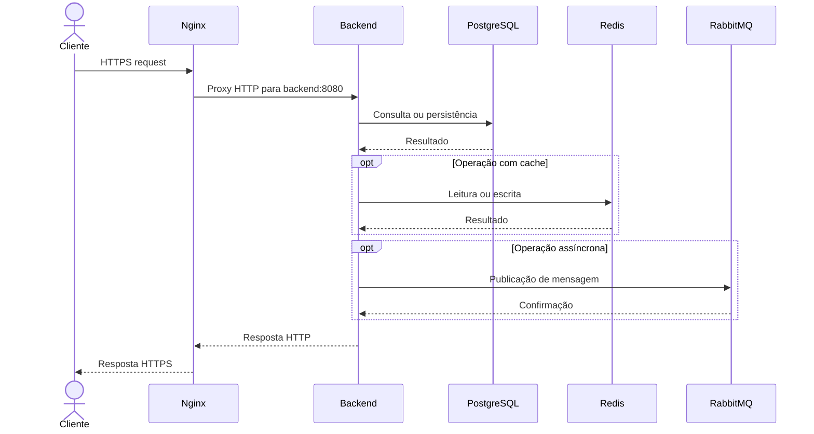

### Observação

A infraestrutura contém Redis e RabbitMQ, mas a auditoria não confirmou uso funcional desses componentes nas regras de negócio atuais.

---

## 7. Fluxo de métricas

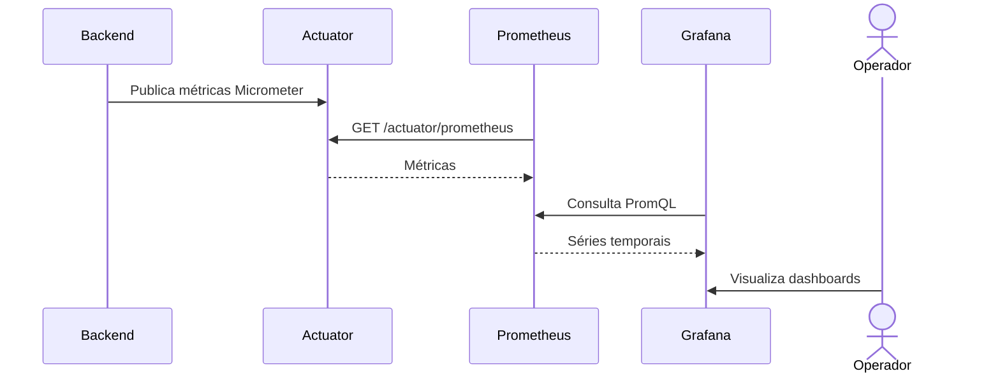

### Limitações

* Prometheus não possui volume persistente;
* Grafana não possui provisioning versionado;
* não existem dashboards versionados;
* não existe Alertmanager;
* não existem regras de alerta;
* não existe coleta centralizada de logs;
* não existem métricas do host ou dos containers.

---

## 8. Topologia de rede Docker atual

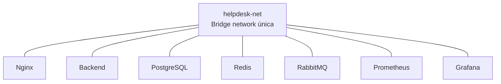

Todos os serviços compartilham a mesma rede Docker.

Consequentemente:

* Nginx pode alcançar serviços de dados;
* Grafana pode alcançar PostgreSQL, Redis e RabbitMQ;
* Prometheus pode alcançar todos os serviços;
* não existe isolamento por responsabilidade.

A segmentação será tratada em uma Issue posterior.

---

## 9. Persistência atual

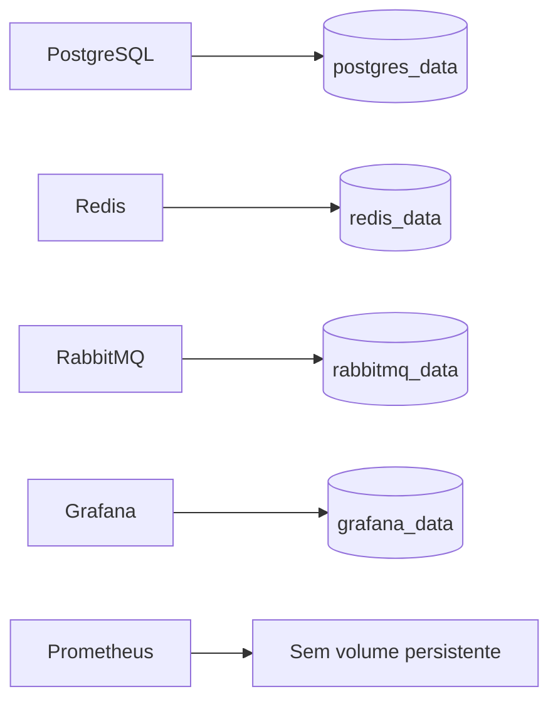

Volumes identificados:

```text
postgres_data
redis_data
rabbitmq_data
grafana_data
```

Não foram identificados:

* backup externo;
* retenção;
* restore;
* teste de restauração;
* persistência do Prometheus.

---

## 10. Provisionamento atual com Terraform

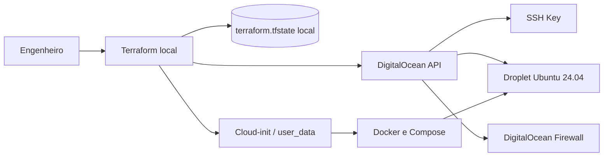

### Limitações

* state local;
* ausência de locking remoto;
* ausência de backend remoto;
* chave pública codificada no Terraform;
* SSH aberto para qualquer origem;
* ausência de usuário dedicado de deploy;
* configuração concentrada em `main.tf`;
* ambiente antigo não pode ser validado.

---

## 11. Estado de saúde atual

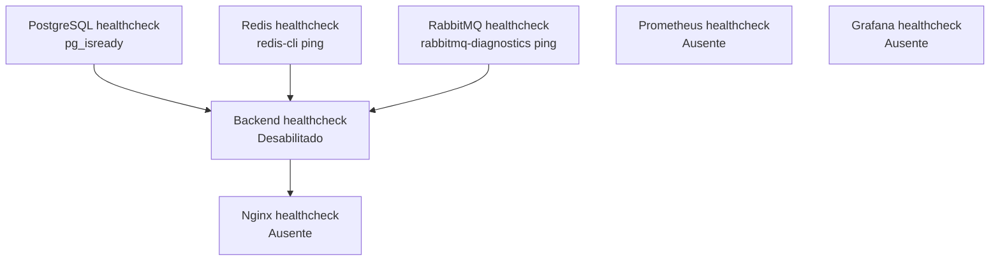

O backend aguarda a saúde de PostgreSQL, Redis e RabbitMQ.

Entretanto:

* o backend não possui healthcheck funcional;
* o Nginx depende apenas da inicialização do container;
* o CD não consulta readiness;
* o deploy pode terminar com a aplicação indisponível.

---

## 12. Diagrama dos principais riscos

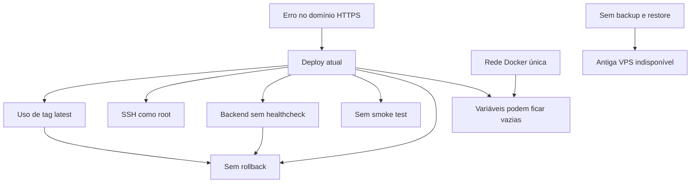

---

## 13. Arquitetura futura desejada após a Fase 0

Este diagrama não representa o estado atual. Ele mostra apenas a direção esperada para a base antes da adoção de Kubernetes.

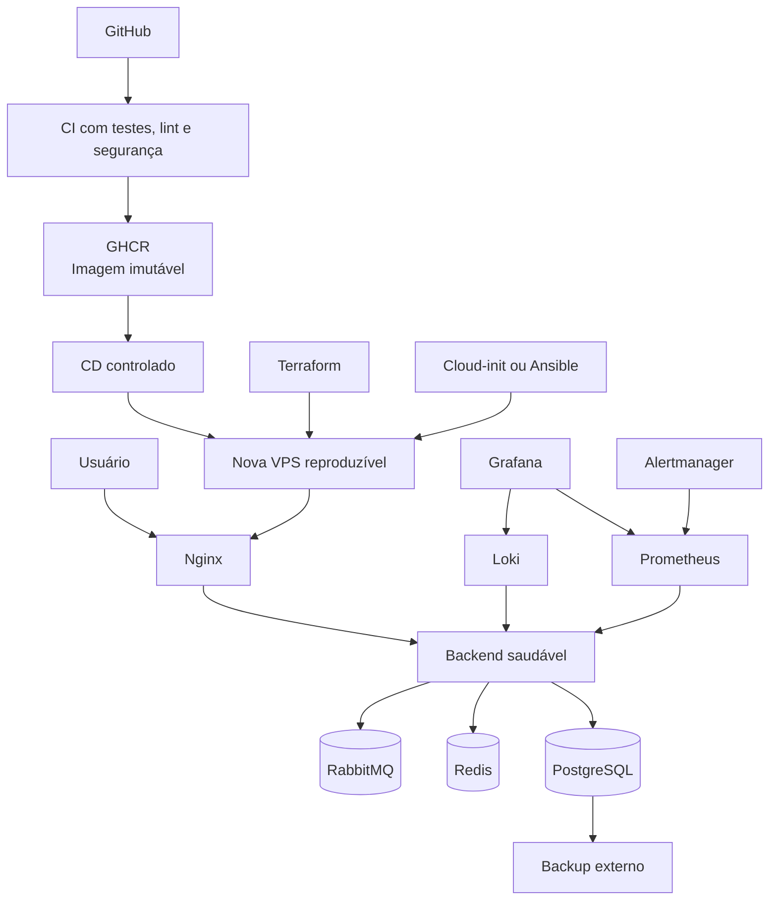

### Capacidades esperadas

* deploy por tag SHA;
* readiness;
* smoke test;
* rollback;
* usuário de deploy não root;
* secrets obrigatórios;
* redes segmentadas;
* Grafana protegido;
* Prometheus persistente;
* logs centralizados;
* alertas;
* backup e restore testados;
* servidor reproduzível;
* documentação operacional.

---

## 14. Conclusão

A arquitetura atual já contém os principais componentes de uma plataforma DevOps inicial.

Entretanto, os componentes ainda estão conectados de forma simples e dependem de processos frágeis.

Os diagramas demonstram que as principais lacunas não estão relacionadas apenas à existência das tecnologias, mas à capacidade de:

* reproduzir;
* validar;
* proteger;
* observar;
* recuperar;
* operar.

A arquitetura atual será utilizada como referência para comparar a evolução ao final da Fase 0.
